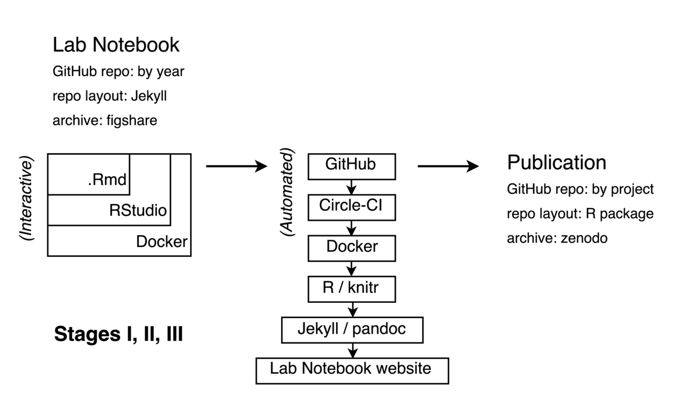

A Reproducible R Notebook Using Docker
======================================

Carl Boettiger
--------------

My name is [Carl Boettiger](http://carlboettiger.info). I'm a theoretical ecologist in [UC Berkeley ESPM](http://ourenvironment.ucberkeley.edu) working on problems of forecasting and decision-making in ecological systems. My work involves developing new computational and frequently data-intensive approaches to these problems.

My workflow seeks to provide a way to capture & reproduce the day-to-day to workings of a computational ecologist using freely available platforms (e.g. GitHub, Travis CI, Docker Hub) and open source software (`R`, RStudio, `git`, `docker`, `jekyll`) in the format of an online, open lab notebook. I have tweaked and adapted this workflow over the past 5 years, often experimenting with new technology. Other researchers have frequently told me how they have adopted parts of this approach, but rarely in an identical way.

My general approach to an open lab notebook has been described previously (Gewin, 2013, Mascarelli (2014)), while I focus on documenting more details of the workflow here. When possible, I have sought to leverage general-purpose tools rather than custom solutions: for instance, I organize project directories using the R package format, as described in Gentleman & Temple Lang (2007) and [rrrpkg](https://github.com/ropensci/rrrpkg) project, rather than introduce my own custom structure. Nevertheless, my current system no doubt remains too complex, specialized, esoteric and even fragile to be easily adopted by others. Rather, I encourage the reader to focus on specific elements or modules that look most practical, as others have done.

### Workflow

 A note to the reader: The following description is meant as a high level overview, which leans heavily on several powerful and well-developed tools and workflows including git/GitHub, docker/DockerHub, `.Rmd`/RStudio, and others. Table 1 provides a concise reference where a reader can learn more about these tools and their use.

<!-- This table is used for the Gitbook online version of the book. It must be kept manually in sync with the main Markdown version of the table. -->

 Table 1: Tools used in workflow

<table style="width:83%;">
<colgroup>
<col width="9%" />
<col width="54%" />
<col width="19%" />
</colgroup>
<thead>
<tr class="header">
<th>Tool</th>
<th>Description / purpose</th>
<th>Website</th>
</tr>
</thead>
<tbody>
<tr class="odd">
<td>git</td>
<td>Version control software</td>
<td><a href="https://git-scm.org" class="uri">https://git-scm.org</a></td>
</tr>
<tr class="even">
<td>GitHub</td>
<td>Online repository for sharing code managed with git</td>
<td><a href="https://github.com" class="uri">https://github.com</a></td>
</tr>
<tr class="odd">
<td>docker</td>
<td>Containerization software for portable computational environments</td>
<td><a href="https://docker.com" class="uri">https://docker.com</a></td>
</tr>
<tr class="even">
<td>DockerHub</td>
<td>Central hub for building and distributing docker containers</td>
<td><a href="https://hub.docker.com" class="uri">https://hub.docker.com</a></td>
</tr>
<tr class="odd">
<td>RStudio</td>
<td>IDE for editing R and Rmd files</td>
<td><a href="https://rstudio.com" class="uri">https://rstudio.com</a></td>
</tr>
<tr class="even">
<td>Rmd</td>
<td>Dynamic documentation format for R language</td>
<td><a href="http://rmarkdown.rstudio.com" class="uri">http://rmarkdown.rstudio.com</a></td>
</tr>
<tr class="odd">
<td>pandoc</td>
<td>convert between document formats</td>
<td><a href="http://pandoc.org" class="uri">http://pandoc.org</a></td>
</tr>
<tr class="even">
<td>servr</td>
<td>An R package for combining jekyll with Rmd</td>
<td><a href="http://yihui.name/knitr-jekyll/" class="uri">http://yihui.name/knitr-jekyll/</a></td>
</tr>
<tr class="odd">
<td>jekyll</td>
<td>Static website generator closely integrated with GitHub</td>
<td><a href="https://jekyllrb.com" class="uri">https://jekyllrb.com</a></td>
</tr>
<tr class="even">
<td>Circle CI</td>
<td>Flexible continuous integration software for executing scripts pushed to GitHub</td>
<td><a href="https://circleci.com" class="uri">https://circleci.com</a></td>
</tr>
<tr class="odd">
<td>figshare</td>
<td>Permanent data archiving platform</td>
<td><a href="http://figshare.com" class="uri">http://figshare.com</a></td>
</tr>
<tr class="even">
<td>zenodo</td>
<td>Permanent archiving platform (handles code/software well)</td>
<td><a href="http://zenodo.org" class="uri">http://zenodo.org</a></td>
</tr>
</tbody>
</table>

#### Interactive workflow

My daily workflow on an active project simply involves opening a new `.Rmd` document with the day's date in my lab notebook. In this file, I write the code, text, equations, and other elements of my work (see diagram, top left).

At the heart of my workflow is the dynamic documentation tool `knitr`. `knitr` is an R package that is tightly integrated into RStudio and R-markdown, or `.Rmd` format it supports for integrating code, documentation, equations, figures and other components of research into a single document. Its key feature is the ability to "knit" or "execute" the document, resulting in the code blocks being run and their output figures, tables, and so forth being displayed in the document. Text and code are written together in the popular, simple, and flexible markdown format, which is widely recognized by other tools (e.g. GitHub, a widely used code repository, and Jekyll, a ruby-based static website generator). Markdown is easily converted into other formats by `pandoc`, a conversion engine integrated into RStudio (and other popular platforms such as Jupyter) which can generate LaTeX, HTML, Microsoft Word and other document formats. This flexibility is useful later in turning my .Rmd files into either HTML pages for my laboratory notebook or into other formats suitable for traditional journal publication.

During active research, I often find it impractical to clearly separate out the stages of Data Input (Stage I), Data Processing (Stage II), and Data Analysis (Stage III). I merely strive to have all of these stages coded and explained in the .Rmd document.

I write / edit this `.Rmd` file inside an instance of RStudio which runs inside a Docker container, which in turn may be running on my laptop, an Amazon Web server, or even an NSF super-computing cluster depending my needs that day. RStudio is a popular integrated development environment for R users which can be run in server mode through a web browser. Docker is a popular containerization tool which allows one to create a portable image of one's entire software environment that can be easily moved around between different computers, regardless of architecture. I believe this has major implications for addressing common problems in reproducibility, as I have described more fully elsewhere (Boettiger, 2015). A Dockerfile in my notebook provides an executable recipe for building this computational environment on top of existing, general-purpose Docker images maintained by the [Rocker project](https://github.com/rocker-org).

#### Automated workflow

At regular intervals I "commit" my notebook in `git` and "push" this progress to GitHub, a widely used version control system and public repository for code and other digital material. This triggers the automated build portion of my workflow, illustrated in the center of the diagram. A Continuous Integration platform ([CircleCI](http://circleci.com) in my case, as the more widely used platform, [Travis](https://travis-ci.org/), did not support Docker execution until much more recently) detects this commit, and begins to execute and assemble my code.

The CI platform begins by pulling down a public image of my computational environment, itself built automatically by Docker Hub from the Dockerfile in my repository. A separate Docker volume container can also be pulled from the Hub which contains results cached by knitr for any code too intensive to run on the (free, public) CI platform.

As the notebook is already organized as a Jekyll repository, just with `.Rmd`-formatted posts instead of plain `markdown`, existing tools (see `servr`, Table 1) can easily execute the R code and format it as a new post in the notebook. Jekyll templates make it easy to add semantic metadata to the post automatically including bibliographic information, links to version history, commit hash, modification date and so forth. At this time a given exploration might not have a particular project connected to it -- it might build from several existing projects, a paper I'm reading, or represent an entirely new exploration. I use categories and tags in the notebook to associate the post with relevant projects or themes, which makes it easier to come back to. (Figuring out appropriate tags is harder than it sounds!)

Each year I archive the GitHub repository that contains that year's notebook on figshare, adding the DOI badge to the repository's README.

#### Project finalization / publication

Eventually multiple entries will relate to the same project. At this point, I frequently want to reuse code first developed in a previous entry. This is my signal that it is time to create a new project on GitHub. (Figuring this out is much harder than it sounds!) I create a new public GitHub repo using a name that matches a tag in the relevant notebook entries. In the `R/` directory I store functions that provide these reusable bits. For non-trivial functions, I try and develop unit tests (in the `/tests` directory) -- these usually come directly from the interactive tests I write in the notebook when first creating these functions. I also add minimal Roxygen documentation to the functions I create, usually just to remind me what the input and outputs are. Data goes in the `/data` directory; or more frequently, as R scripts that either simulate or download and clean the data from external sources.

Notebook pages do not load these functions as a single package -- as the package is constantly changing this is unlikely to continue to work anyway. Instead, they source in the script directly from the version-explicit links on GitHub. (I learned this the hard way). This avoids the burden of making sure the 'package' is always installable, it just serves as a convenient organizational skeleton.

I continue to develop, test, and explore results in the pages of the notebook, adding and modifying functions as necessary. This usually involves plenty of mistakes and dead ends that are captured in the history of an individual page (when I modify an existing workflow to correct the results) or are left as dead (or incompletely explored) ends in the various pages of the notebook under that category.

Once the work has coalesced around a particular set of ideas and results appropriate for a single manuscript, I begin drafting the manuscript as a `.Rmd` file in the GitHub repository, often based on `.Rmd` files from the notebook. The `rticles` package from RStudio provides a template system which makes it easy to render `.Rmd` files into `pdf` articles for various journal formats.

When preparing for submission, I upload a copy of the manuscript (in `tex` format, generated from the `Rmd`) to the [arXiv](http://arxiv.org) and configure the Zenodo permanent archive which connects automatically to GitHub, much like a Continuous Integration service. Zenodo then generates a permanent archive with a unique Digital Object Identifier (DOI) every time it detects a new 'release' on GitHub. GitHub releases are part of the `git` tag system and can be used to signal a new version of software or publication of a paper. A DOI badge from Zenodo is then displayed on the GitHub repository.

The reader is encouraged to view any of the real-world examples of this process in the repositories of my recent projects, such as <https://github.com/cboettig/nonparametric-bayes>, or in the pages of my online lab notebook at <http://carlboettiger.info/lab-notebook>.

The frequency of these steps is highly variable -- from many commits a day to gaps of months. See my GitHub commit history for a more realistic answer. In addition, although most of my research projects involve others, I am the only researcher committing to my lab notebook, just as we see in paper notebooks. The final research product will see more direct involvement by others.

### Pain points

Knowing when to refactor and how to avoid fragile and opaque design. A good reproducible workflow should be like good software: built from simple, easy-to-understand modules that do one task well. Most reproducible workflows, mine included, can too readily resemble most scientific spaghetti code: pieces tacked together over the years because they got the job done. The best way to make a workflow or code understandable is to *refactor* it after it works, breaking it into well-defined, well-tested modules with clear input and output. Pretending research can be written like this from the start is fiction, but just capturing all the messiness provides none of the abstraction that makes something more re-usable and reliable. I don't have a good solution for how to do this though -- refactoring is demanding and offers few incentives.

### Key benefits

A key benefit of this approach is making my work portable and scalable. By making it easy to reproduce my computational environment and analyses, it suddenly becomes much easier to re-run an analysis on a cloud machine or cluster if it proves too large for my local system.

A second benefit has been the ability to explore research ideas more easily. New ideas often build on old ones, and the dread of having to remember how some old stuff worked in the first place before tinkering with it to explore something new was often enough to make me turn to something easier.

### Key tools

I believe any of the tools mentioned in Table 1 could be of use to a broader audience. I have tried to place the more general near the top -- GitHub and Docker address very general issues in computational reproducibility, justifying their wide adoption. These tools can inserted into many common workflow patterns without requiring significant re-tooling.

For R users, RStudio has made the Rmd format far more practical as an authoring environment, both for websites (e.g. with `servr` package) and journal articles (`rticles` package). However, these tools may require both a bigger shift from existing strategies and offer a smaller benefit.

The particular pattern I have used to chain this together with CI, etc, is probably less generally applicable, and has a higher learning curve than the afore-mentioned tools.

### Questions

#### What does "reproducibility" mean to you?

Reproducibility in this context is 'computational reproducibility.' It means a good-faith effort to make sure that the analysis can produce qualitatively identical results while running on comparable hardware. This means certain things do not need to be reproduced: e.g. how long the code takes to run may vary by hardware and operating system, but this is okay. Nor am I not concerned with bitwise identical results, nor with necessarily reproducing stochastic random draws -- rather, I expect conclusions from reproducible results to be robust to the details of stochastic seed or choice of random number generator.

I am also concerned that reproducibility is modular -- that individual components of the analysis can be reproduced (and thus recombined or otherwise modified), and not merely provide a black box that can only replicate final outputs without variation or adjustment.

Lastly, I think it is important to identify *who* should be able to reproduce the analysis. Like the paper itself, the analysis requires a certain degree of expertise to understand, and I do not expect that individuals with no familiarity with programming, statistics, or scientific process can reproduce the analysis. However, I do expect that researchers with some scientific background in my area (e.g. the broadest readership of the journal in which it is published) and with minimal familiarity with the R language or similar computing langauage can reproduce the overall results after suitable investment of time and effort in reading the documentation.

#### Why do you think that reproducibility in your domain is important?

Reproducibility makes results more reliable, and more importantly, makes it easier to extend, test, and build upon existing results. Ultimately this makes it easier for an individual to build on their own work and the work of others, making for faster, better science.

#### How or where did you learn about reproducibility?

Independent study of examples, experimentation, and reading, and connecting with other researchers sharing similar interests through the internet and social media.

#### What do you see as the major challenges to doing reproducible research in your domain, and do you have any suggestions?

Not a standard practice. In the short-term it takes more time. It may also increase the probability of errors in your work being discovered.

#### What do you view as the major incentives for doing reproducible research?

Making research easier to do. Reproducible research facilitates collaboration, particularly with myself. It improves my confidence in my own results and helps me build more efficiently on work that I have already done.

#### Are there any best practices that you'd recommend for researchers in your field?

Adopting tools that are widely used within my field (and others) for reproducibility. These include: GitHub, Docker, rmarkdown.

#### Would you recommend any specific resources for learning more about reproducibility?

The documentation linked in Table 1 would be a great place to start on any of the individual tools. Additionally, see the reproducible research workshop developed by NESCent: <https://github.com/Reproducible-Science-Curriculum>

### References

Boettiger, C. (2015). An introduction to Docker for reproducible research, with examples from the R environment. *ACM SIGOPS Operating Systems Review*, *49*(1), 71–79. <http://doi.org/10.1145/2723872.2723882>

Gentleman, R., & Temple Lang, D. (2007). Statistical Analyses and Reproducible Research. *Journal of Computational and Graphical Statistics*, *16*(1), 1–23. <http://doi.org/10.1198/106186007X178663>

Gewin, V. (2013). Turning point: Carl Boettiger. *Nature*, *493*(7434), 711–711. <http://doi.org/10.1038/nj7434-711a>

Mascarelli, A. (2014). Research tools: Jump off the page. *Nature*, *507*(7493), 523–525. <http://doi.org/10.1038/nj7493-523a>
