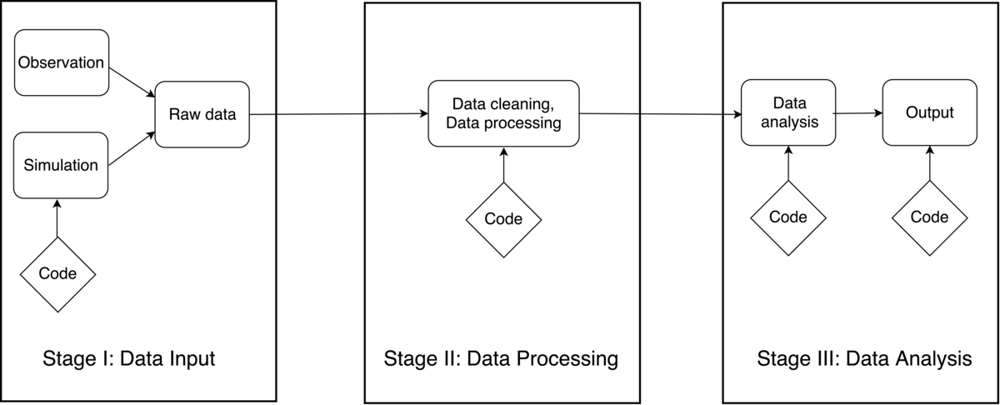

Case Studies in Reproducible Research
=====================================

Daniel Turek and Fatma Deniz
----------------------------

Having discussed the context and the general practices of reproducible research, we will now shift focus to a collection of concrete examples of scientific research workflows, all of which strive to attain a high degree of reproducibility. These case studies of reproducible research are the foundation for our study of approaches and current best practices for achieving computational reproducibility. By studying these real-world examples, we are able to draw conclusions regarding the tools, software, and current trends of reproducible scientific research.

In this chapter, we begin by introducing the concept and format of the case studies, including the motivating factors behind the general framework of a case study. Next, we describe the methods and process of collecting the case studies from researchers spanning a range of scientific disciplines. The case studies themselves shed light upon a natural classification into two distinct categories. This classification is described, and an index of the case studies is provided. As a high level summary, we next present broad descriptions and summary statistics of the case studies. These provide insight into the currently most common tools and methodologies facilitating reproducible research. Finally, we provide some suggestions for reading the case study chapters to attain a deeper understanding of these examples. These suggestions are intended to help readers identify ideas and insights for crafting their own reproducible scientific research workflows.

### What is a case study?

A case study is a comprehensive description of the computational workflow that a researcher used to complete a single, well-defined scientific research project. Each case study describes how particular tools, ideas, and practices have been combined to support reproducibility. Emphasis is placed on the *how*, rather than the why or what, of reproducible research. Each case study can be viewed as one approach among many possibilities for how a researcher approached the challenge of reproducibility.

Each case study follows a consistent, standardized format. Each begins with a short biography of the author, including their affiliation, discipline, and a brief abstract describing the subject of their case study. The body of each case study consists of the three core sections: a workflow narrative accompanied by a flowchart diagram, a discussion of the most important tools and achievements of the workflow, and a discussion of the most significant problems encountered in achieving reproducibility.

The workflow narrative and diagram are the heart of each case study. The diagram outlines the project in a manner similar to a circuit diagram: boxes represent steps in the process, and arrows represent the flow of information into subsequent steps. Most diagrams are built around combinations of specialized tools, version controlled repositories, databases, scripts, and end products such as statistical conclusions, functional software, or scientific publication. The workflow narrative ties closely to the diagram, and explains various stages and flow of information shown in the diagram. The narrative provides an opportunity for authors to discuss topics such as the appropriate use of tools, how various steps were automated, the history of raw data, and whether the software that is used for analysis is publicly available with sufficient documentation and testing.

Following the workflow narrative and diagram, each case study highlights the main successes of reproducible research from the project. This *Key Benefits* section describes the ways in which following this reproducible workflow has improved the author's research, often by making it more efficient, transparent, and trustworthy in addition to more reproducible. This section may also discuss how the project benefited from the reproducible or open-source nature of other projects and how other researchers could reuse portions of the workflow.

Finally, in the *Pain Points* section, each case study reflects on the most troublesome obstacles encountered in the pursuit of reproducibility. These challenges may have been successfully navigated, or may still remain. Examples include data sets that could not be made publicly available, legacy code inherited from other scientists, or difficulties in collaborating with other scientists without experience or interest in reproducible research. These troublesome aspects should be equally as instructive as the successes and key tools, since they highlight the practical hurdles to producing fully reproducible research.

Case studies may also include a *Key Tools* section, which specifically points out any software or other tools that helped achieve a reproducible workflow. And finally, some case studies address several optional questions, which touch on the broader context of reproducible research and its challenges. Where provided, answers to these questions are included at the close of the case study. The optional questions posed to each author were:

-   What does "reproducibility" mean to you?

-   Why do you think that reproducibility in your domain is important?

-   How or where did you learn about reproducibility?

-   What do you see as the major challenges to doing reproducible research in your domain, and do you have any suggestions?

-   What do you view as the major incentives for doing reproducible research?

-   Are there any best practices that you would recommend for researchers in your field?

-   Would you recommend any specific resources for learning more about reproducibility?

This format for case studies was designed largely before eliciting the case studies from contributing authors. This format was selected to serve several purposes. Foremost, the workflow narrative and diagram are intended to provide a clear visualisation of the end-to-end scientific workflow, as well as the author's commentary and description of this process. Either alone would not provide a comprehensive idea of their approach to achieving reproducibility. Second, the remaining sections are designed to clearly distinguish important aspects of the researchers' approach to reproducibility. While similar information may also appear in the workflow narrative, the *Key Benefits*, *Pain Points*, and *Key Tools* sections isolate these concepts, and force each author to reflect clearly on the strengths and weaknesses of their approach. Combined, these sections provide a comprehensive view of authors approach and experiences in their quest to achieve reproducibility.

### Collecting the case studies

The process of collecting case studies was coordinated by a core group from the Berkeley Institute for Data Science, at the University of California, Berkeley. This process of collecting case studies spanned a period of approximately six months.

Initially, the core group drafted a general framework of a reproducibility case study. At its inception, this consisted only of the workflow diagram and accompanying narrative. Members of this group each wrote a case study describing one of their own research projects. After examining these initial submissions, a formal template for a case study was created. This consisted of the introductory biographical questions for each author, a description and guidelines for the narrative and diagram, and a set of questions regarding various aspects of reproducibility.

This template was later distributed to attendees of a Reproducibility Workshop hosted at the Berkeley Institute for Data Science. One session of this workshop gave attendees the opportunity to draft a case study describing their own research. Although attendees only had a few hours to work on their submissions during the workshop, the majority took additional time after the workshop to finalize their case study. A third and final round of case studies was later elicited through personal requests to leading scientific researchers.

### Classification and Index

As described in the last chapter, a data-intensive research workflow can be divided into three main stages: data input/acquisition, data processing, and data analysis and outputs. The first stage represents data acquisition, input, or creation. Regardless of the source of the data (via collection, simulation, or otherwise), the final result of this stage is one or more raw data sets. The second stage includes both cleaning and processing of this raw data. This can include many different tasks such as consolidating, organizing, or digitizing, the output of which is a cleaned dataset fully prepared for the third stage. Finally, the third stage includes all statistical analyses, visualizations, and the creation of output products. This may frequently result in scientific publication, but many other forms of output are possible, such as software tools, public repositories, scientific conclusions, or actionable insights. An outline of a fully generic scientific workflow into these three distinct stages is shown in Figure 1.

 Using this three-stage taxonomy, the case studies naturally fell into one of two broad categories. The first we called "high-level" case studies, which describe a complete scientific workflow involving all three stages. These generally provide a lighter treatment of each stage, and contain fewer technical details. The second category is called "low-level" case studies, which consists of those case studies describing only one or two of these three stages. These low-level examples generally provide a more detailed or technical treatment of the various stages. Low-level case studies are further classified by which stage(s) they describe.

Using this classification, we present in Table 1 an index of all case studies contained in this book. Each case study is classified as either high-level or low-level, and according to the scientific discipline from which it is drawn. This index is intended to help guide readers in their exploration of the case studies.

<!-- This table is used for the Gitbook online version of the book. It must be kept manually in sync with the main Markdown version of the table. -->

 Table 1: Guide to case study chapters

<table>
<colgroup>
<col width="25%" />
<col width="18%" />
<col width="56%" />
</colgroup>
<thead>
<tr class="header">
<th align="left">Author</th>
<th align="left">Discipline</th>
<th align="left">Topic</th>
</tr>
</thead>
<tbody>
<tr class="odd">
<td align="left"><strong>HIGH LEVEL</strong></td>
<td align="left"></td>
<td align="left"></td>
</tr>
<tr class="even">
<td align="left"></td>
<td align="left"></td>
<td align="left"></td>
</tr>
<tr class="odd">
<td align="left">Anthony Arendt</td>
<td align="left">Applied Physics</td>
<td align="left">Impact of glacial melt on rising global sea levels</td>
</tr>
<tr class="even">
<td align="left">Pablo Barberá</td>
<td align="left">Political Science</td>
<td align="left">Studying political polarization on social media websites</td>
</tr>
<tr class="odd">
<td align="left">Carl Boettiger</td>
<td align="left">Theoretical Ecology</td>
<td align="left">Forecasting and decision-making in ecological systems</td>
</tr>
<tr class="even">
<td align="left">Garret Christensen</td>
<td align="left">Economics</td>
<td align="left">Causal impacts of military history on soldier recruitment</td>
</tr>
<tr class="odd">
<td align="left">Jan Gukelberger</td>
<td align="left">Physics</td>
<td align="left">Diagonalization simulations for quantum systems</td>
</tr>
<tr class="even">
<td align="left">Chris Hartgerink</td>
<td align="left">Applied Statistics</td>
<td align="left">Validating statistical methods to detect data fabrication</td>
</tr>
<tr class="odd">
<td align="left">Chris Holdgraf</td>
<td align="left">Neuroscience</td>
<td align="left">Feature extraction for predictive models of the brain</td>
</tr>
<tr class="even">
<td align="left">David Holland</td>
<td align="left">Applied Mathematics</td>
<td align="left">Climate change and melting of the great ice sheets</td>
</tr>
<tr class="odd">
<td align="left">Justin Kitzes</td>
<td align="left">Ecology</td>
<td align="left">Analyzing bat activity using autonomous acoustic detectors</td>
</tr>
<tr class="even">
<td align="left">Andy Krause</td>
<td align="left">Civil Science</td>
<td align="left">Analysis of US household locations in metropolitan areas</td>
</tr>
<tr class="odd">
<td align="left">José Manuel Magallanes</td>
<td align="left">Political Science</td>
<td align="left">Using bill cosponsorship data to detect political trends</td>
</tr>
<tr class="even">
<td align="left">Benjamin Marwick</td>
<td align="left">Anthropology</td>
<td align="left">Understanding prehistoric hunter-gatherer behaviour</td>
</tr>
<tr class="odd">
<td align="left">Olivier Mesnard</td>
<td align="left">Aerospace Engineering</td>
<td align="left">Full replication of computational fluid dynamics results</td>
</tr>
<tr class="even">
<td align="left">K. Jarrod Millman</td>
<td align="left">Statistics / Psychology</td>
<td align="left">Assessing reliability for human classification of autism</td>
</tr>
<tr class="odd">
<td align="left">K.A.S. Mislan</td>
<td align="left">Environmental Science</td>
<td align="left">Comparison of blood-oxygen binding characteristics</td>
</tr>
<tr class="even">
<td align="left">Kellie Ottoboni</td>
<td align="left">Statistics / Public Health</td>
<td align="left">Analyzing association of salt consumption and mortality</td>
</tr>
<tr class="odd">
<td align="left">Karthik Ram</td>
<td align="left">Data Science</td>
<td align="left">Developing tools to support stages of reproducible research</td>
</tr>
<tr class="even">
<td align="left">Ariel Rokem</td>
<td align="left">Neuroscience</td>
<td align="left">MRI studies of brain structure and function</td>
</tr>
<tr class="odd">
<td align="left">Rachel Slaybaugh</td>
<td align="left">Nuclear Engineering</td>
<td align="left">Numerical methods to study neutral particle interactions</td>
</tr>
<tr class="even">
<td align="left">Daniela Ushizima</td>
<td align="left">Image Processing</td>
<td align="left">Devising machine vision and pattern recognition algorithms</td>
</tr>
<tr class="odd">
<td align="left">Zhao Zhang</td>
<td align="left">Computer Science</td>
<td align="left">Image processing with cloud computing using Apache Spark</td>
</tr>
<tr class="even">
<td align="left"></td>
<td align="left"></td>
<td align="left"></td>
</tr>
<tr class="odd">
<td align="left"><strong>LOW LEVEL</strong></td>
<td align="left"></td>
<td align="left"></td>
</tr>
<tr class="even">
<td align="left"></td>
<td align="left"></td>
<td align="left"></td>
</tr>
<tr class="odd">
<td align="left">Kyle Barbary</td>
<td align="left">Cosmology</td>
<td align="left">Analyzing supernova data to measure universe expansion</td>
</tr>
<tr class="even">
<td align="left">Fatma Deniz</td>
<td align="left">Image Processing</td>
<td align="left">Generating two-tone Mooney images to study brain activity</td>
</tr>
<tr class="odd">
<td align="left">Konrad Hinsen</td>
<td align="left">Molecular Biophysics</td>
<td align="left">Analysis of molecular dynamics trajectories for biomolecules</td>
</tr>
<tr class="even">
<td align="left">Kathryn Huff</td>
<td align="left">Nuclear Engineering</td>
<td align="left">Simulation framework for nuclear fuel cycle analysis</td>
</tr>
<tr class="odd">
<td align="left">Randy LeVeque</td>
<td align="left">Applied Mathematics</td>
<td align="left">New approaches to probabilistic tsunami hazard assessment</td>
</tr>
<tr class="even">
<td align="left">Tara Madhyastha</td>
<td align="left">Neuroscience</td>
<td align="left">Neuroimaging workflow using automated build tool</td>
</tr>
<tr class="odd">
<td align="left">Gilberto Pastorello</td>
<td align="left">Computer Science</td>
<td align="left">Data processing pipelines and data management solutions</td>
</tr>
<tr class="even">
<td align="left">Russell Poldrack</td>
<td align="left">Neuroscience</td>
<td align="left">Analysis of neuroimaging, behavioral, and metabolomic data</td>
</tr>
<tr class="odd">
<td align="left">Valentina Staneva</td>
<td align="left">Mathematics</td>
<td align="left">Developing stochastic filtering methods for tracking objects</td>
</tr>
<tr class="even">
<td align="left">Daniel Turek</td>
<td align="left">Statistics</td>
<td align="left">Developing and testing efficient statistical algorithms</td>
</tr>
</tbody>
</table>

### Trends among the case studies

Despite representing a wide range of scientific disciplines, many similarities exist between the various case studies. Here, we summarize several of the main trends and the emergent characteristics which can be observed. This includes a summary of the main languages used for computational research, trends in data sharing and version control, and other high level properties.

This book contains a total of 31 contributed case studies of reproducible workflows. Among them, 21 are high-level workflows describing the end-to-end process including data input or acquisition, data processing, and data analysis. The remaining 10 case studies are low-level workflows, which provide greater detail on one or two of these stages. Approximately one third of the low-level case studies discuss data input or acquisition (Stage 1), half describe data processing (Stage 2), and half discuss data analysis (Stage 3). Note that some low-level case studies cover two of these stages, for example both data processing and data analysis.

Each of the 31 case studies represent a data-centric computational scientific workflow, and therefore describes various tools or languages for data management, data processing, or scientific computing. Although myriad computational tools are described, a few are extremely widely represented among the case studies. In particular, 17 of the 31 case studies (55%) make use of Python, an open-source, high-level and general-purpose programming language. This accurately reflects the current popularity of Python, thanks to to rapid development cycle, the high readability of Python code, and the extremely wide range of applications supported by Python. The next strongest representation is of R, an open source programming language for statistical computing, which is used in 13 of the 31 case studies (42%). This is an accurate representation of the wide-spread use of R among data analysts, and generally the statistics community at large, as R is now considered the primary ecosystem for statistical computing. Following Python and R, a vast range of other programs and computational tools have a comparatively modest representation among the case studies. To name just a few of the more mainstream tools, these include C/C++, MATLAB, Julia, Scala, Java/JavaScript, and oftentimes custom-developed software, although this listing is far from comprehensive.

Appropriate use of version control is a key aspect of modern reproducibility. This applies equally for software development and the computer code underlying computational workflows. Older (centralized) version control systems were more cumbersome for users, but the recent introduction of git and GitHub have made version control more accessible for smaller-scale projects. The vast majority (over 80%) of the case studies make use of git and GitHub for version controlling the development of software or analysis code, which represents one of the strongest trends among the case studies. A number of the remaining case studies explain that the nature of the workflow is not appropriate for version control, for example when describing a protocol for data management. Further, a few case studies make use of other version control software -- for example, Bitbucket or SVN -- but these represent a small minority.

In support of transparency and reproducibility, there is an on-going shift within academic communities in support of open data and data sharing. Indeed, 19 of the 31 case studies (over 60%) make use of publicly available data, or themselves describe the process of making their data publicly available. However, an open-data policy is not universally practiced, as in some disciplines the extreme overhead of data collection deters scientists from openly sharing it. That is an unfortunate reality in some fields, for example cosmology, astrophysics, or neuroscience, but the current trend among the scientific and academic communities is strongly moving towards the use of open data.

There is also a clear trend in the output medium of the case studies, although we believe this may be an artifact of the contributing group of authors rather than of reproducible workflows in general. The collection of case studies was drawn from the academic community, where primary emphasis is placed on scientific publication. All but a few of the case study workflows culminate in producing a scientific manuscript intended for peer-reviewed publication. Perhaps more important, slightly over one third of the case studies also describe a second output. This is typically manifested as a software product, or an analysis algorithm intended for wider use. Other, less common, secondary outputs include data management pipelines, or interactive websites.

### Reading the case studies

As readers consider the design of their own reproducible scientific workflow, a wealth of knowledge and experience is available in the case studies presented at the end of this book. However, reading the case studies may be daunting, as many are technical and may assume familiarity with computational tools or specific application domains. For this reason, we now provide some suggestions for reading the case studies.

We encourage readers who are new to reproducible research to begin by skimming through the high-level case studies, which provide a general overview of research workflows from a variety of disciplines. This will provide a general idea of what is contained in the case studies, and may highlight disciplines that have faced, or have solved, similar challenges to those faced by the reader. Ecologists and cosmologists, for example, both often work with high-resolution spatial data, while neuroscientists and empirical economists may encounter similar issues surrounding data anonymization.

As readers become familiar with the format and presentation of the case studies, they might next consider a detailed reading of the case studies drawn from the most closely related disciplines to their own. In these examples, the nature of the scientific research is more likely to be familiar to the reader. In addition, they are likely to give an idea of what tools, challenges and approaches are being used in one's own discipline.

Finally, the motivated reader is encouraged to undertake detailed readings of both high-level and low-level case studies which address the tools or issues most closely related to your own research. Case studies will invariably discuss technical tools, topics, and methods that will not be familiar to you. Rather than including explanations of these technical concepts in each chapter, we have provided descriptions of the most common terms and tools in a technical glossary at the end of the book. Readers are encouraged to refer to this glossary frequently while reading through the case studies.

It is important to note that each case study is a problem-specific example of a reproducible workflow. Rather than attempting to recreate any particular workflow, ideas should be selected from a variety of case studies to create your own customized approach to reproducibility. However readers decide to navigate the collection of case studies, they should keep in mind that *every* case study has some useful insights to offer -- including those drawn from unrelated disciplines. We encourage readers to study a variety of the workflows presented, since this approach is most likely to give a flavor of the common techniques and best practices generally applicable to scientific research.
