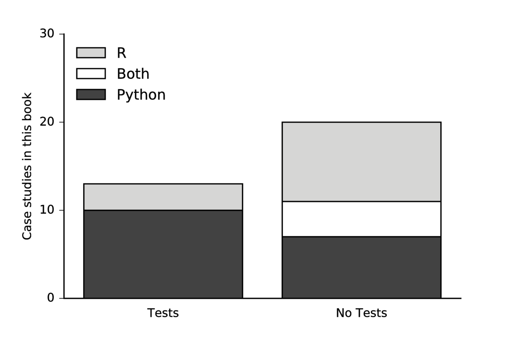

Lessons Learned
===============

Kathryn Huff
------------

Although the case study authors came from a variety of research backgrounds, a set of themes emerged out of this collection of their workflows. Similar struggles arose despite differing scientific fields (ecology, neuroscience, astronomy, nuclear engineering) and nearly irrespective of preferred programming language (i.e. R, Python, C++, Matlab). This chapter will summarize some of the common themes among the case studies, both painful and positive.

It should be noted that the sample of chapter contributors is not a representative sample of scientists in these research fields. Indeed, these scientists contributed to the book because they are particularly interested in open science and reproducibility. Accordingly, we can imagine that where these scientists have pain points, many of their colleagues may give up on reproducibility outright.

Some key findings include the optimistic observation that git and GitHub are nearly ubiquitous among the case study authors. Additionally, we saw that among respondents, scripting analysis wherever possible is widely accepted as essential. For both reasons, plain text file formats were preferred.\
Testing and continuous integration was seen as crucial to maintaining reproducibility by those who have integrated these steps into their process, but quite a few respondents didn't mention either practice as part of their workflow. Finally, some of the most successful approaches were those that fundamentally recognize and adapt to the "ubiquity of error" that the scientific method defends against (Donoho, Maleki, Rahman, Shahram, & Stodden, 2009).

Obstacles to reproducibility included issues with humans, computers, and the institutions that both inhabit. The case studies made clear, for example, that humans must be incentivized to spend time on tasks intended solely for reproducibility. This can be complicated by skill variation and disparate tool familiarity within research groups. But, even when the tools are used, a lack of access to restricted data or hardware can hobble reproducibility efforts of even the most determined scientists. Similarly, portability of one's workflow is still a challenge for those intent on openness, since packaging - especially installation of dependencies - remains a critical stumbling block to sharing and extending work.

In the following sections, this chapter will discuss the lessons we learned from the case studies. First, this chapter will briefly mention how various scientists perceive reproducibility, then it will focus on the pain points. Next we will make note of oft-mentioned workflow tools, and finally this chapter will note some novel ideas that the case study authors had up their sleeves.

### The Meaning of Reproducibility

The case study authors were prompted to give many perspectives as they prepared their case studies. One was "Define what the term *reproducibility* means to you..."

Some authors teased out quite a bit of the subtlety embedded in this semantic question. K. Jarrod Millman, Kellie Ottoboni and Philip Stark, for example, broke down reproducibility into four distinct types.

1.  *Computational reproducibility and transparency*, which emphasizes code documentation.

2.  *Scientific reproducibility and transparency*, which emphasizes documentation of scientific decisions and accessibility of data.

3.  *Computational correctness and evidence*, which emphasizes automated testing and validation.

4.  *Statistical reproducibility*, which emphasizes transparency of data analysis the logical path to scientific conclusions.

Most authors, however, expressed some flavor of either computational reproduciblity or replicability.

#### Computational Reproducibility

There was general agreement among most authors about at least one aspect of what reproducibility means: that when provided with identical source code, input data, software, and computing environment configurations, that an independent party can exactly reproduce the results of the original work -- especially published results. This is described in our glossary as *computational reproducibility*.

This aspect of reproducibility was articulated particularly well by the following case study authors -- although each definition has its own interesting subtleties:

Jan Gukelberger:

> In general, given a publication (in a refereed journal), source codes and raw data (which might be available publicly or in the institute's repositories), an expert from my field should be able to understand, and in principle repeat, every step of the study from the running of the correct version of the simulation code to the final results presented in the published paper.

Justin Kitzes:

> I consider a study to be (computationally) reproducible when I can send a colleague a zip file containing my raw data and code and he or she can push a single button to create all of the results, tables, and figures in my analysis.

Andy Krause:

> "Reproducibility" means that a subsequent interested party can openly access the data, code, analytical workflow and data provenance to re-create the research (and ideally produce identical results) WITHOUT consulting the original researcher(s).

These echo a well-established perspective on reproducibility (Donoho et al., 2009; Stodden, 2010; G. Wilson et al., 2014) that is evolving as a community norm through checklists and pledges such as the "Reproducibility PI Manifesto" (Barba, 2012). A few of our case study authors have taken this pledge in which a PI vows to adopt practices that add a level of sustainability and extensibility to reproducible work:

1.  Teaching group members about reproducibility

2.  Maintaining all code and writing under version-control

3.  Carrying out verification and validation and publishing the results

4.  For main results in a publication, sharing data, plotting scripts, and figures under CC-BY

5.  Uploading preprints to arXiv at the time of submission of a paper

6.  Releasing code no later than the time of submission of a paper

7.  Adding a "Reproducibility" statement to each publication

8.  Keeping an up-to-date web presence

The importance of this sustainable, extensible kind of reproducibility was noted by Kyle Barbary:

> To me, reproducibility has two facets: the availability of usable software (preferably under an open-source license), and the availability of data (preferably in both raw and reduced forms). Together, these should give an outsider the ability to reproduce the results of a study from start to finish. I separate these two aspects because each can be beneficial without the other. For example, even without releasing data, it can still be quite beneficial to release software. If released under an open-source licence, this provides a different flavor of reproducibility - the ability to reproduce an algorithm described in a paper and use and improve that algorithm in subsequent work.

#### Replicability

When the final conclusions can be confirmed based on a different experiment, scientists consider this validation of the result. In this vein, Valentina Staneva distinguishes between exact and approximate reproducibility:

> "Exactly reproducible" - when a result can be regenerated exactly as suggested given the same set of inputs and parameters.
>
> "Approximately reproducible" - when a result or similar performance can be generated with similar or different methods than the one proposed on the same or possibly slightly different data.

Some have used the term "replicability" for this approximate reproducibility. Ariel Rokem put it this way:

> A higher standard, sometimes called 'replicability' would be to require that the same conclusions be reached if another group of researchers were to do the same experiments, and implement the same ideas in their analysis. Reproducibility does not guarantee replicability \[Leek and Peng, 2015\]. Some may even argue that reproducibility and replicability may sometimes be in conflict, because implementation errors can be propagated in reproduction, but not in replication \[Peng2009, Baggerly2005\].

Validation of a scientific result is achieved in this way when one can repeat the scientific work with a new method or implementation and draw the same conclusions.

### Pain Points

We also asked the case study authors which features of their workflows presented challenges to reproducibility. Irrespective of the type of reproducibility being sought, we hoped that these pain points would reveal areas of particular need - workflow bottlenecks where innovation might improve the experience of reproducible science. The following sections highlight some of these frustrating, time consuming, opaque, or fragile obstacles and mentions when they may represent high priority needs for better tools and improved strategies.

#### People and Skills

Research teams are diverse. Computational skills especially vary dramatically from one researcher to another even within the same lab. The blinding pace of innovation in software tools means that even well-prepared collaborators can't expect to always keep up with the newest tools. Manuscript preparation software, database formats, and version control systems used by one scientist may be equally modern but nonetheless incompatible with the software stack familiar to their collaborators.

When the case study authors reported that the bottleneck to adopting practices was related to a diversity of skills, the indication was universally that the process might have been more efficient or reproducible were there a greater and more homogeneous distribution of tool familiarity among their research group members. Time was wasted when simple tasks like communicating results or simultaneously editing a manuscript were crippled by one or more collaborators unfamiliar with tools used by their colleagues.

The concern also extended far beyond mere efficiency. One case study author noted that if a collaborator is unable to use the tools that are being employed, then they are at risk of being disenfranchised from the scientific process. This disenfranchisement is especially ethically problematic if a collaborator is unable to directly or simultaneously edit a co-authored manuscript due to their lack of familiarity with the processing tools (e.g. LaTeX.)

A scientist unwilling to disenfranchise their collaborators could certainly elect to use more widely used tools, accepting frustration with inefficiency as the price of collaboration. However, the price is often paid in reproducibility as well when those widely-used, lowest-common-denominator tools conflict with reproducibility goals. This is especially the case with tools such as Microsoft Word, Excel, or Matlab which were noted as particularly problematic fallbacks, as their closed-source GUI-based nature is fundamentally fragile to reproducibility issues.

So, in the interest of both reproducibility and efficiency, some case study authors were inclined to proceed with the use of preferred tools (e.g. LaTeX) nonetheless. Those scientists largely saw the pain point caused by a\
difficulty of communication with and understanding from their peers. The ethical quandary for those scientists competed with the commitment to more effectively communicate their results (reproducibly and transparently) with the larger scientific community -- even if it had the effect of hobbling communication internally.

**Need:** Better education of scientists in more reproducibility-robust tools.

**Need:** Widely used tools should be more reproducible so that the common denominator tool does not undermine reproducibility.

#### Dependencies, Build Systems, and Packaging

Just as scientists "stand on the shoulders of giants," our software perches upon forests of dependency trees. A single step in our workflow may rely on dozens of libraries and scientific software packages which may each, in turn, rely on many other libraries and packages.

Accordingly, the first obstacle for use, sharing, and adoption of any software stack or analysis workflow is often the battle to simply get the workflow running on a different machine than that on which it was created. This first obstacle easily becomes the last for busy scientists, and halts reproducibility in its tracks. If another scientist can't even install LAPACK with your special compiler flags, they have no hope of building, installing, or running your software pipeline. Reproducing or extending your work becomes an unreachable dream.

This packaging problem varies in magnitude and complexity from field to field. Where some software may require a cross platform build system capturing the compiler flags for weaving together a fleet of system libraries, other software simply requires a download and some documentation of the steps to execute. These case studies spanned the gamut therein.

Many case study authors noted that their data analysis pipeline relied on a specific computational platform or build environment. Their dependencies may be limited to certain platforms or features of the build environment may need to be customized for various options to function. These environment issues quickly become too complex to manage as a manual feat and must be packaged in a robust, cross-platform way if they have any hope of succeeding.

Case study authors packaged their work in myriad ways. Lightweight strategies were often fragile to cross-platform-configuration issues (e.g. bash scripts and makefiles). More robust solutions (e.g. virtual machines), however, are usually more clunky and often less transparent. While a one-click-download runnable virtual machine may be the most reliable option for replicating a simulation, it is also the most opaque to the user. Compromise solutions such as configuration and build systems (e.g. CMake) are often simultaneously clunky and transparent. Notably, there are subtle differences between these solutions. In particular, build and configuration systems are often more bespoke (and fragile) than broader (and often rigid) packaging systems like conda/bundler/packrat.

It's now thirty years after the invention of autotools, but cross platform configuration, build, and packaging systems are not yet a solved problem. Somehow, scientific software developers still await a robust and universal solution. Thankfully, there is hope. The tech industry, facing similar issues, has developed portable container management systems (Bernstein, 2014) such as [Docker](https://github.com/docker/docker) and [Kubernetes](https://github.com/kubernetes/kubernetes). These technologies are enabling a new generation of scientific packaging tools for reproducible and open science (e.g. [tmpnb](https://github.com/jupyter/tmpnb), [binder](https://github.com/binder-project/binder), ReproZip (Chirigati, Shasha, & Freire, 2013), Code Data Environemnt (Guo, 2012), etc.).

**Need:** Improved configuration and build systems for portably packaging software, data, and analysis workflows.

#### Hardware Access

The build system situation is a special small-scale case of a larger problem of variable hardware access. At that end of the spectrum, there are challenges getting a workflow running on your collaborator's laptop in addition to your own. At the other extreme is access to high performance computing hardware or unique experimental devices.

The Large Hadron Collider is often brought up as an example of an experiment so large that it will never be repeated in a different experimental location on a comparable device, so in some ways it fails the verifiability test. Many fields suffer this on a small scale at the data collection stage, where, for example, an experiment can't reproduced by just anyone; it must be reproduced by someone with a similarly configured MRI machine.

This hardware access issue was noted at the data collection step in the case studies, but it was also noted at the analysis step. That is, when scientific simulations or large scale data analysis is conducted on very high performance, high capacity, or high throughput computer systems, it is similarly vulnerable to being irreproducible. Not only is access to such resources limited and the hardware often unique, but the sheer amount and variety of metadata likely needed to reproduce results without complication is often enormous. While high throughput computing is being democratized by cloud computing resources, the capability computing of high performance computing machines, necessary for some applications, is not yet replaced by those services. Even cloud computing has limitations, as noted by case study author Arendt, whose collaborators found connecting to cloud servers was limited by bandwidth constraints in Alaska.

**Need:** Reproducibility at scale for high performance computing. A detailed discussion of this need can be found at (Hunold & Träff, 2013)

**Need:** Standardized hardware configurations and experimental procedures for limited-availability experimental apparatuses.

#### Testing

Many case study authors who developed code beyond simple scripts discussed testing that code systematically. This practice, in addition to being hygenic and improving robustness, is a type of self-check on reproducibility. Software tests and continuous integration in particular allow software authors to automate frequent checking that code consistently performs as expected even as new features are added.

Experiences varied. Some consider tests to be a core element in their workflows and emphasized unit testing -- comprehensive atomic tests at the function level -- for providing confidence that their work can be reproduced. Other case study authors perform integration tests before trusting a result, but not as an active part of development. In all cases, when tests were mentioned in the case studies, the authors were convinced of their utility at saving time and energy. However, not all case studies mentioned tests at all. One is left to wonder what is stopping those and other scientists from adopting these practices. Perhaps they are discouraged by the perceived effort of unit testing or the trade-offs of time spent now versus time saved later. In many cases, a lack of familiarity with unit testing may be the barrier.

It is also worth noting that the use of testing frameworks varied by language more than by scientific domain. In particular, the case study authors who used primarily Python reported testing at a much higher rate than case study authors who rely primarily on R. This is summarized in the figure below.

Of course this is not a statistically significant sample, so conclusions about these communities are somewhat premature, but resulting conversations have indicated to us that this difference in community adoption of testing practice may indeed be present.

**Need:** Better understanding of why researchers don't respond to the delayed incentives of unit testing as a practice.

**Need:** Norms encouraging greater adoption of unit testing irrespective of programming language.

#### Publishing

The most universally shared step in the research process is publication. In a literate programming sense, papers can be integrally automated and "runnable." For the majority of the case studies, however, the production of the research paper capturing the work was reported to be somewhat independent of the science. In other cases a more literate programming method was adopted through the use of Jupyter notebooks or judicious use of rmarkdown.

The workflows were very tool-driven in the sense that the tools used defined the way that the workflow progressed. The factions within the case studies included a LaTeX-based group, a knitr/rmarkdown/sweave contingent, and a frustrated Microsoft Word contingent.

Microsoft Word track changes deserves a special place in this discussion, so ubiquitous is its use worldwide and so consistent were the experiences of the four who mentioned it. Each scientist that mentioned Word had effectively two things to say:

(1) We used it because a collaborator couldn't figure out LaTeX and

(2) Track Changes certainly tracks changes, but is frustrating because the merging limitations mean that edits must be made in series rather than in parallel.

A reproducible paper is a large and varied task, perhaps demanding its own separate workflow.

**Need:** Broader community adoption around publication formats that allow parallel editing (i.e. any plain text markup language that can be version-controlled in a distributed manner.). Tools such as Overleaf and SageMathCloud are a beginning toward making LaTeX more approachable, but greater adoption is needed.

#### Data Versioning

Mere data storage is not always sufficient for the purpose of reproducibility. Occasionally, data may need to be versioned so that changes can be tracked, evaluation and cleaning steps can be rewound, and work can be extended.

Case study authors often either noted they were not versioning their data or noted that they were struggling to find a good way to do so. Since this challenge -- versioned storage of larger (or more varied, or high velocity) data -- is currently being encountered in the "big data" age of the software industry, active innovation in industry and new solutions are already being implemented.

Tools being developed to streamline the process of data versioning include GitHub Large File Service, Dat, git annex, datalad and others. While these operate in different ways, they typically involve compression, tracking of changes, and efficient retrieval.

**Need:** Greater scientific adoption of new industry-led tools and platforms for data storage, versioning, and management.

#### Time and Incentives

Perhaps the most vexing impediment to reproducibility the case study authors and their collaborators suffered from was a lack of time, incentives, or both.

Some case study authors, perhaps as a symptom of their recognition of the importance of reproducibility, were incentivized by confidence in the efficiency of these practices. Many noted the time they saved when repeating calculations, making modifications to analysis, and extending past work.

Conversely, the sentiment that \`\`time and efforts spent on creating reproducible research are not very well rewarded'' (case study author Dr. Valentina Staneva) was eachoed by a few authors. This need for additional reward, support, and recognition for reproducible work is an institutional infrastructural issue especially in the academy where metrics for promotion and tenure are tied explicitly to papers and often fail to account for reusable software.

But, while the promotion and tenure process is in need of modernization, funds-granting organizations are moving faster. Private foundations like Moore, Sloan, and Helmsley are leading the charge by supporting large initiatives directed at scientific software reproducibility and transparency. Similarly, government institutions like NSF, NIH, and (less quickly) DOE, are incorporating requirements for openness and data planning as well. Similarly, some journals are implementing data and software submission requirements to incentivize reproducbility at the publication stage. The efficacy of these increased standards for publication and funding, however, depend fundamentally on the enforcement mechanism. For the incentives to compel action, paper referrees must be willing to give due diligence by trying to run the submitted code and grant performance reviewers must be similarly be willing to review data management plan compliance.

**Need:** Increased community recognition of the benefits of reproducibility.

**Need:** Incentive systems where reproducibility is not only self-incentivizing.

#### Data restrictions

In the same way that transparent analysis is core to reproducing scientific work, access to raw data can also be essential for reproducibility. Indeed, it can be necessary for confirming conclusions during review and exploring alternative methods during extension by other scientists. In some fields, however, data access is legally restricted. Some such data restrictions concern human subjects research, such as survey and private medical data. Some restrictions concern national security, such as the restriction of export controlled nuclear data or risk map data. Researchers in these fields are therefore limited in their ability to do completely open science, but can often, behind the export control or IRB wall, share analysis methods with colleagues who do have access to the data.

**Need:** Standards around scrubbed and representational data so that analysis can be investigated separate from restricted data sets.

### Actionable Recommendations

We are not the first to discuss reproducibility. Nor shall we be the last. Thus, many themes were repeated among the recommendations of the scientists:

-   version control your code

-   open your data

-   automate everywhere possible

-   document your processes

-   test everything

-   use free and open tools

Less common refrains that are already well established best practices within the current reproducibility climate include:

-   avoid excessive dependencies

-   when dependencies can't be avoided, package their installation

-   host code on a collaborative platform (e.g. GitHub)

-   get a Digital Object Identifier for your data and code

-   avoid spreadsheets, plain text data is preferred ("timeless," even)

-   explicitly set pseudorandom number generator seeds

-   workflow and provenance frameworks may be too clunky for most scientists

At the core of many of these issues are human concerns around incentives and delayed return on investment. Education and community development will be needed to solve those issues where tool improvements fail to help.

### Tools Used

The vast majority of scientists used a programming language such as R or Python to churn through analysis and automate processing.

Nearly all reported use of GitHub-based version controlled repositories at the core of their research work. Additionally, scientists often cited use of an ecosystem of tools appropriate for their work. The following sections categorize tools by their purpose, rather than by the ecosystem (e.g. R vs. Python) that they are found in most commonly.

#### Publishing

For publishing, the case study authors improved their reproducibility with What You See Is What You Mean (WYSIWYM) mark-up languages. Some preferred LaTeX/Overleaf, while others preferred the R/Knitr/RMarkdown/Sweave ecosystem. In combination with a text editor and distributed version control, both reproducibility and simultaneous collaboration are improved by these plain text mark-up languages.

#### Data Handling

The scientists used many different formats and systems for storing and cleaning their data. Some storage systems include both hierarchical (e.g. HDF5) and relational (e.g. SQL) database systems. Of particular note, the R community representation among these case studies boasted use of the RStudio IDE as part of the way they streamline access to the collection of R tools which enable some of these data repository solutions as well as data cleaning and exploration tasks.

Additionally, emerging \`\`data lakes'' for archived storage and retrieval such as Dataverse (King, 2007) were also mentioned. Case study authors even noted that specialized data lakes exist for certain scientific domains. Neurovault (Gorgolewski et al., 2016) was mentioned for neuroscience, but similar solutions exist other fields as well (e.g. Dryad (H. C. White, Carrier, Thompson, Greenberg, & Scherle, 2008) for ecology).

#### Testing Frameworks

In the Python ecosystem, tests can be run with frameworks such as [nose](https://nose.readthedocs.org/en/latest/) or [unittest](https://docs.python.org/3/library/unittest.html). In C++, one can use [Googletest](https://code.google.com/p/googletest/). In both Python and C++ projects, testing frameworks were mentioned by multiple case study authors.

Although very few R users mentioned unit testing their code, the language does have options for unit test frameworks, with the testthat package (Wickham, 2011) being the most widely-used unit testing framework. Other available packages exist as well, such as the RUnit package.

#### Continuous Integration

Although few of the case study authors mentioned continuous integration, its use was lauded as essential. Reproducible practices are easiest to adopt when they require no time from the scientist. Even better, practices that save time are even easier to adopt. Continuous integration is just such a practice.

To get scientists to regularly run the tests for their software on a variety of platforms, don't require any effort of the scientist. That is, outsource the task of building and running the tests to the computer with a continuous integration system. Essential to production software, continuous integration servers like [CTest](https://cmake.org/Wiki/CMake/Testing_With_CTest), [Travis-CI](https://github.com/travis-ci/travis-api), [Jenkins](https://jenkins.io/), [Batlab](https://batlab.org/), and many others enable scientists to focus on implementation without worrying about checking constantly whether they're introducing bugs. If they introduce a bug, the continuous integration server will notice and send out and email or publish a status report.

#### DOI Management

A primary incentive for scientists is citation. Accordingly, the efforts they put toward reusable workflows will only seem worthwhile if those data, scripts, libraries, and analyses can be cited. Thus arises the DOI. Many methods exist for putting a citeable, persistent, digital stamp on one's code and data.\
Common services for archiving digital objects and providing DOIs were mentioned in the case studies including Zenodo, Figshare, and the Open Science Framework.

### Other Recommendations

Perhaps most interesting among all of the recommendations are some insights that were only noted by one or two of the scientists. Some of these recommendations may be impactful if they see broader adoption.

#### Post Flurry Refactoring

Chapter authors Randall LeVeque and Rachel Slaybaugh each expressed their own version of the following idea:

> Make a habit of cleaning up code used to produce final results so that it's well documented and all the necessary steps are clearly laid out. Then run through them from scratch if possible to insure that it works. Even if you don't plan to share it with others, your future self will thank you.

This kind of workflow doubles down on the importance of documentation and clarity for users (including your future self). By emphasizing good practices during the day-to-day, this kind of workflow ensures that code is consistently useable by its author during development. By similarly employing best practices during the release or publication stage, this type of workflow effectively double-checks the reproducible nature of the work.

This workflow concept is especially enamoring because it recognizes the humanity of the scientist, who in a day-to-day work environment may let a few tasks necessary for full reproducibility to slip through the cracks. It then corrects for that element of human frailty by budgeting time at the wrapping-up stages to correct for that human error and solidify the process, like a time capsule for the future.

#### Standardized Data Formats

In the case studies, it was mentioned that a GIS standard is needed to help unify work with maps and geospatial data. This unification of work through collectively adopted standards applies to other fields as well. When a proliferation of standards complicates collaboration within a scientific domain, community agreement on a single standard can allow reproducibility across research groups.

A number of fields have long since successfully adopted data format standards, such as the Flexible Image Transfer System (FITS) files used in astronomy or the evaluated nuclear data files (ENDF) used in nuclear physics. Efforts are ongoing to standardize formats in other fields, where formats may be absent, insufficient, or (possibly worse) proliferant. For example, there is work in the emergent, data-driven field of neuroimaging to establish a standard for neurological images and see that standard adopted across the field (the Brain Imaging Data Structure).

It's worth noting, though, that even when a scientific domain has a community standard, it may not translate well in interdisciplinary work, when internal domain norms around data formats may hamper efforts to communicate. This can be ameliorated if domain standards are more universal standards, based perhaps on common data formats (e.g. SQL databases, HDF5, plain text).

**Need:** Community adoption for file format standards within some domains.

**Need:** Domain standards which translate well outside of their own scientific communities.

### Conclusion

Many positive lessons came from this set of case studies. One was the reassurance that git and GitHub as well as automation in general are now ubiquitous among the case study authors - scientists seeking reproducibility. Accordingly, 'timeless' plain text file formats are preferred for code and small scale data. A return to transparent open formats based in plain text bodes well not just for reproducibility, but also for its siblings openness and transparency.

Some core needs that were identified include:

-   Better education of scientists in more reproducibility-robust tools.

-   Widely used tools should be more reproducible so that the common denominator tool does not undermine reproducibility.

-   Improved configuration and build systems for portably packaging software, data, and analysis workflows.

-   Reproducibility at scale for high performance computing.

-   Standardized hardware configurations and experimental procedures for limited-availability experimental apparatuses.

-   Better understanding of why researchers don't respond to the delayed incentives of unit testing as a practice.

-   Greater adoption of unit testing irrespective of programming language.

-   Broader community adoption around publication formats that allow parallel editing (i.e. any plain text markup language that can be version-controlled.

-   Greater scientific adoption of new industry-led tools and platforms for data storage, versioning, and management.

-   Increased community recognition of the benefits of reproducibility.

-   Incentive systems where reproducibility need not be self-incentivizing.

-   Standards around scrubbed and representational data so that analysis can be investigated separate from restricted data sets.

-   Community adoption for file format standards within some domains.

-   Domain standards that translate well outside of their own scientific communities.

While building and installation of dependencies remains a critical stumbling block, the most universal problems are human in nature, ranging from establishing basic toolkit familiarity within a team to motivating reproducible workflows according to their long term benefits. Similarly, though community norms both in and across domains are still in need of unification, many scientists interested in reproducibility are converging on a set of best practices for reproducible, open, robust science. Finally, some solutions - especially those related to human incentives - await institutional changes.

### References

Barba, L. A. (2012). Reproducibility PI Manifesto. <http://doi.org/https://dx.doi.org/10.6084/m9.figshare.104539.v1>

Bernstein, D. (2014). Containers and Cloud: From LXC to Docker to Kubernetes. *IEEE Cloud Computing*, *1*(3), 81–84. <http://doi.org/10.1109/MCC.2014.51>

Chirigati, F., Shasha, D., & Freire, J. (2013). Reprozip: Using provenance to support computational reproducibility. In *Presented as part of the 5th USENIX Workshop on the Theory and Practice of Provenance*. Retrieved from <https://www.usenix.org/conference/tapp13/technical-sessions/presentation/chirigati>

Donoho, D. L., Maleki, A., Rahman, I. U., Shahram, M., & Stodden, V. (2009). Reproducible Research in Computational Harmonic Analysis. *Computing in Science & Engineering*, *11*(1), 8–18. <http://doi.org/10.1109/MCSE.2009.15>

Gorgolewski, K. J., Varoquaux, G., Rivera, G., Schwartz, Y., Sochat, V. V., Ghosh, S. S., … others. (2016). NeuroVault. org: A repository for sharing unthresholded statistical maps, parcellations, and atlases of the human brain. *NeuroImage*, *124*, 1242–1244. Retrieved from <http://www.sciencedirect.com/science/article/pii/S1053811915003067>

Guo, P. (2012). CDE: A tool for creating portable experimental software packages. *Computing in Science & Engineering*, *14*(4), 32–35. Retrieved from <http://scitation.aip.org/content/aip/journal/cise/14/4/10.1109/MCSE.2012.36>

Hunold, S., & Träff, J. L. (2013). On the State and Importance of Reproducible Experimental Research in Parallel Computing. *arXiv:1308.3648 \[Cs\]*. Retrieved from <http://arxiv.org/abs/1308.3648>

King, G. (2007). An introduction to the Dataverse Network as an infrastructure for data sharing. *Sociological Methods & Research*, *36*(2), 173–199. Retrieved from <http://smr.sagepub.com/content/36/2/173.short>

Stodden, V. (2010). The Scientific Method in Practice: Reproducibility in the Computational Sciences. *SSRN Electronic Journal*. <http://doi.org/10.2139/ssrn.1550193>

White, H. C., Carrier, S., Thompson, A., Greenberg, J., & Scherle, R. (2008). The Dryad data repository: A Singapore framework metadata architecture in a DSpace environment. *Universitätsverlag Göttingen*, 157. Retrieved from <http://www.oapen.org/download?type=document&docid=353956#page=173>

Wickham, H. (2011). Testthat: Get started with testing. *The R Journal*, *3*(1), 5–10. Retrieved from <http://immagic.com/eLibrary/ARCHIVES/GENERAL/JOURNALS/R110623I.pdf#page=5>

Wilson, G., Aruliah, D. A., Brown, C. T., Chue Hong, N. P., Davis, M., Guy, R. T., … Wilson, P. (2014). Best Practices for Scientific Computing. *PLoS Biol*, *12*(1), e1001745. <http://doi.org/10.1371/journal.pbio.1001745>
